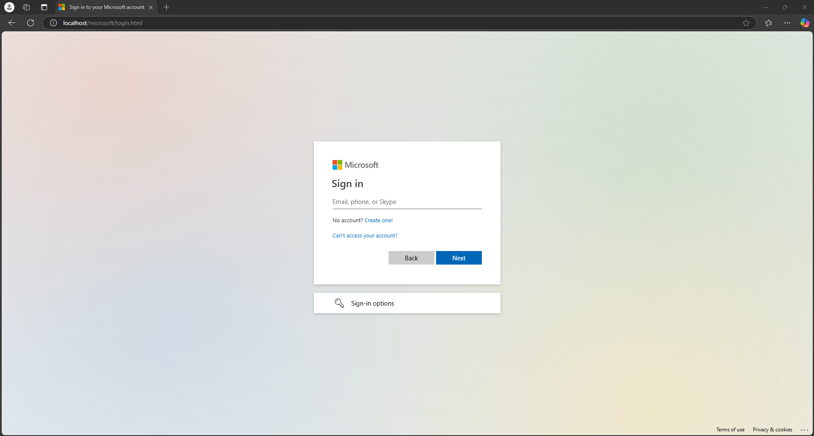
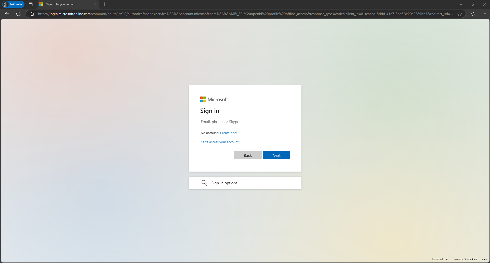
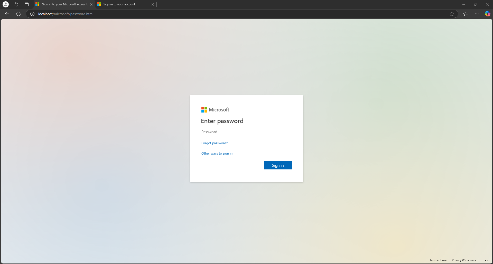
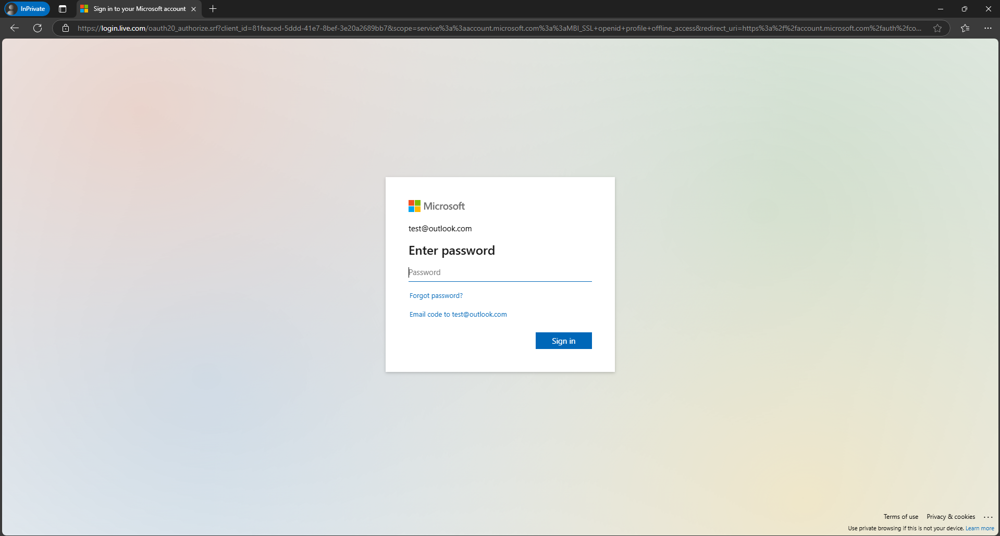

# Microsoft Login Spoof
Retooled version of Microsoft's login page that can be used in controlled phishing exercises

Intended solely for use in employee training

## Overview

Using code from the Microsoft Login Page and my own modifications, this site functions extremely similarly to the Microsoft Login, but collects the email and password entered via PHP.

Due to content filtering by Google, attempting to publicly host this site will result in your Domain Registrar revoking your Domain Name and your site being flagged.

Users start on the login.html page, input an email, are directed to the password.html page, input a password, and are then redirected to the actual login.

All information is timestamped and stored in the usernames.txt file.

## Examples

### Login Page

Fake (Top) vs. Real (Bottom):

      

### Password Page

Fake (Left) vs. Real (Right):

      
